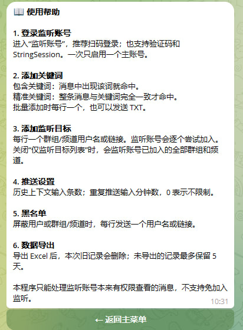
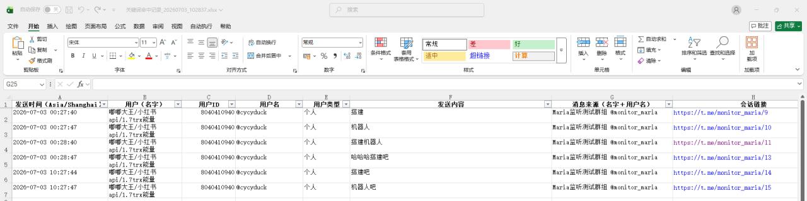
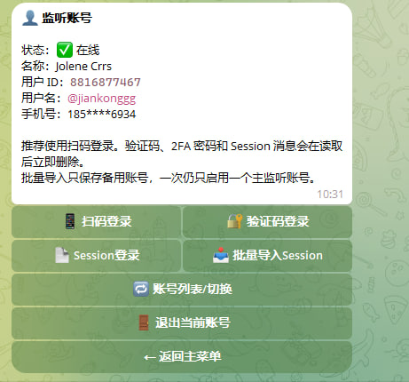
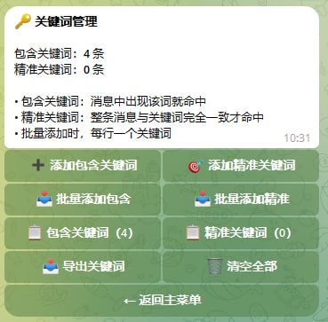
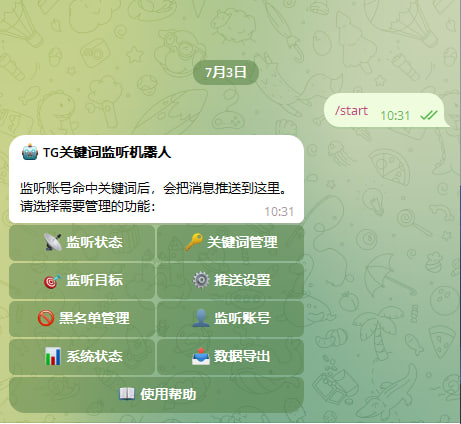
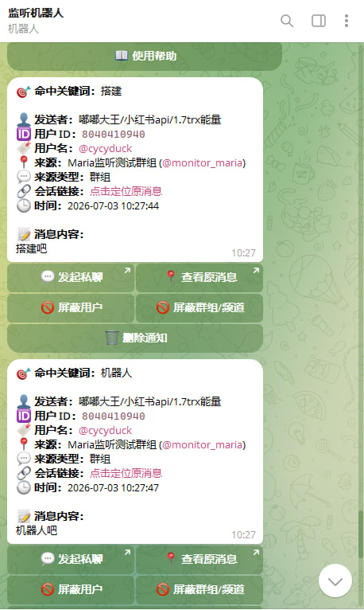

# Telegram 关键词监听机器人

 [💬 TG商务合作](https://t.me/cy_MariaBuild) · [📢 TG项目频道](https://t.me/Maria_Build)

> 本仓库仅用于项目功能展示与商务合作介绍，不提供核心源码、数据库、Session及一键安装包。

一套用于 Telegram 群组、频道及私聊消息关键词监控的独立部署机器人。

监听账号发现指定关键词后，系统会立即向管理员推送消息来源、发送者信息、消息内容及原消息链接，方便及时查看和处理目标信息。

## 项目截图

### 机器人首页



### 关键词管理



### 监听账号管理



### 监听目标管理



### 关键词命中通知



### Excel数据导出



## 主要功能

- 支持监听群组、频道及私聊消息
- 支持包含关键词和精准关键词
- 支持关键词单独添加及批量添加
- 支持通过 TXT 批量导入、导出关键词
- 支持监听账号已经加入的全部群组和频道
- 支持仅监听指定群组或频道
- 支持批量导入群组、频道用户名或邀请链接
- 支持扫码登录监听账号
- 支持手机号及验证码登录
- 支持 2FA 二步验证
- 支持 Telethon StringSession 登录
- 支持批量导入备用 Session
- 支持用户黑名单
- 支持群组及频道黑名单
- 支持自定义历史上下文条数
- 支持自定义重复推送间隔
- 支持忽略机器人消息和监听账号自己的消息
- 命中通知显示发送者、用户名、消息来源和时间
- 支持跳转查看原消息
- 支持快捷屏蔽用户或消息来源
- 支持关键词命中记录导出 Excel
- 历史数据自动定期清理
- 支持独立 VPS 部署
- 支持 systemd 开机自启
- 支持在线自检、日志查看和数据维护

## 关键词匹配方式

### 包含关键词

消息中只要包含指定关键词，即可触发通知。

例如设置关键词：

```text
机器人搭建
